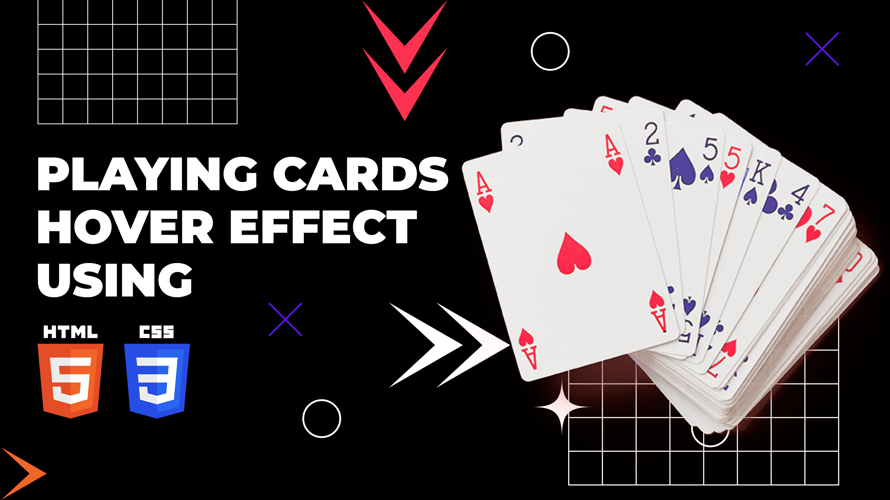

# Playing Cards Hover Effect Using HTML CSS | Playing Cards Animation

The Playing Cards Hover Effect, implemented with HTML and CSS, introduces an interactive and visually engaging animation to playing card elements on a webpage. Leveraging HTML for structure and CSS for styling and animation, this effect likely involves creative transformations or movements when a user hovers over a playing card, mimicking the dynamic nature of real-life card interactions. This animation brings a playful and immersive touch to the webpage, making it an entertaining feature for gaming websites, card games, or any context where a deck of cards is involved. The Playing Cards Hover Effect combines simplicity with interactivity, creating a delightful user experience that captures attention and adds a touch of fun to the interface.

Youtube Tutorial Link: https://youtu.be/AzhZKEPbM08

